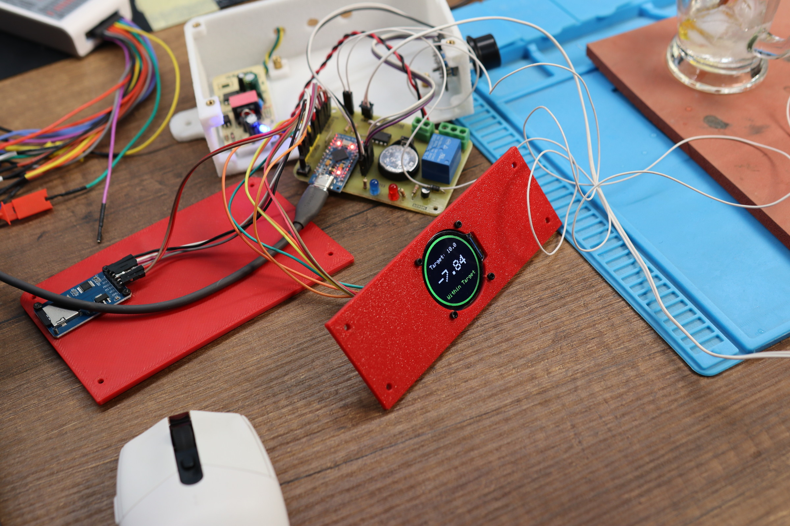
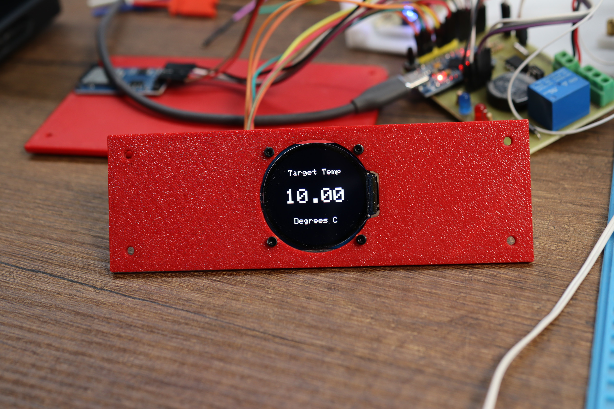
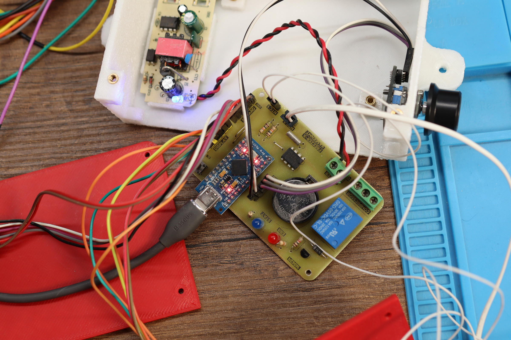

# Freezer X Controller

This project is a custom controller board built to replace the original controller of my freezer that stopped working. It is based on the Arduino Pro Micro and operates by reading the 10K NTC in the fridge and controlling the compressor relay.
**Note:** This controller *does not* replace the built-in compressor relay; instead, it uses an additional relay to control it.

[Dev Log Video](https://www.youtube.com/watch?v=zM9pKCJK8DQ)

**Disclaimer:** I do not recommend anyone build or use this as-is. Use it as a reference only. This was built for my specific use case, and it may or may not meet your needs.

    
    

### Features:
- Interactive menu with configurable settings (target temp, dead time, max temp, hysteresis, etc.)
- Compressor dead time (minimum time the compressor must remain off before turning on again)
- Compressor overheating protection
- NTC short/disconnection handling (min/max temp)
- Raw SD card data logging
- Startup delay

### Important Notes:
1. **RTC Clock is disabled in the code**
   The RTC clock was originally intended to add real-time data to the logs. However, the IC used proved unreliable, so the RTC functionality was disabled in the code to save space.

2. **USB Serial / CDC**
   The USB CDC peripheral is disabled in the PlatformIO configuration to save flash storage space. This means `Serial.print()` cannot be used, **and the board needs to be manually reset during code uploads.**

   You can likely re-enable it now that the RTC is disabled, as there should be enough space available.

3. **SD Card Raw Data**
   Data is logged directly to the SD card without a filesystem by sending raw SPI commands. This approach was taken as an extreme storage-saving measure since most SD card libraries require too much space.
   [I wrote a blog post about this topic if you're interested](https://yaseen.ly/writing-data-to-sdcards-without-a-filesystem-spi/).
